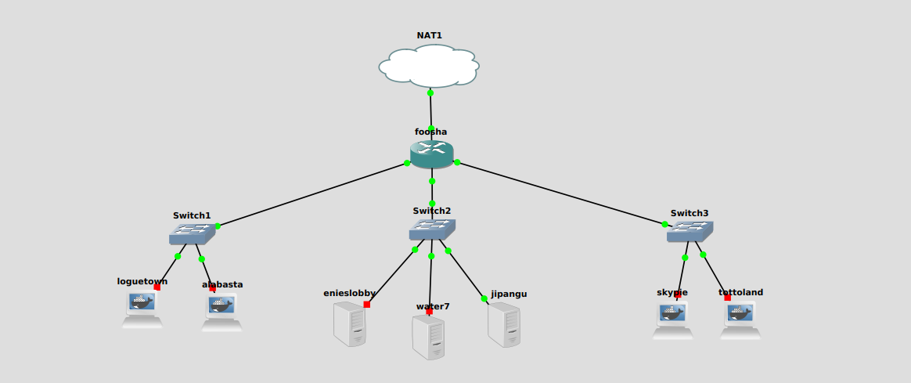
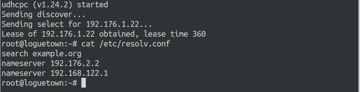
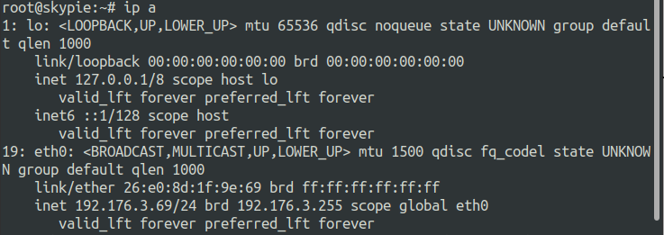
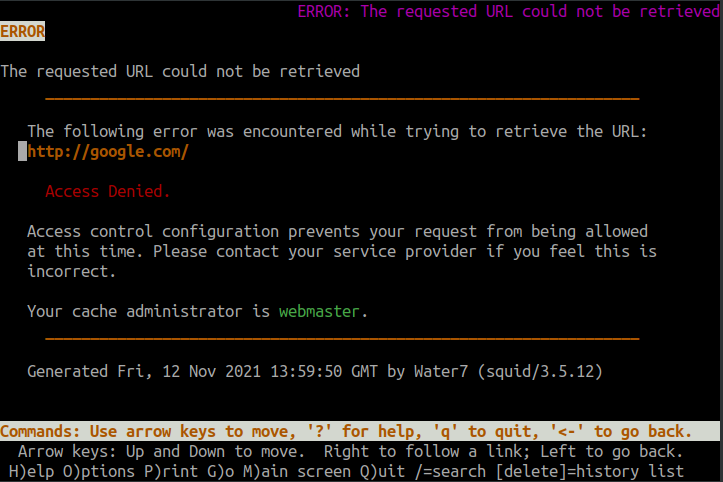
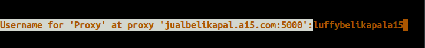
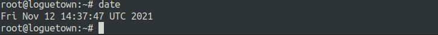
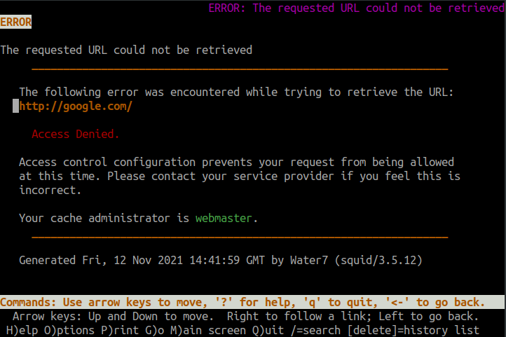
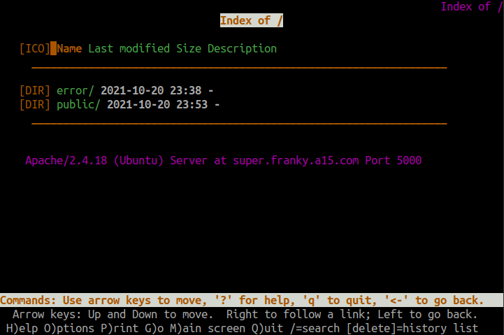

# Jarkom-Modul-3-A15-2021

Laporan Resmi 3 Modul 3 Jaringan Komputer

### Anggota Kelompok :

|      NRP       |     Nama     |
| :------------: | :----------: |
| 05111940000034 | Aimar Wibowo |
| 05111940000064 | Ifanu Antoni |

## Nomor 1

`EniesLobby` akan dijadikan sebagai DNS Master, `Water7` akan dijadikan DNS Slave, dan `Skypie` akan digunakan sebagai Web Server. Terdapat 2 Client yaitu `Loguetown`, dan `Alabasta`. Semua node terhubung pada router `Foosha`, sehingga dapat mengakses internet.

### Penjelasan Nomor 1

Pertama membuat topolgi seperti berikut



Kemudian melakukan config IP pada `Edit network configuration` pada setiap `node`.

`Foosha` sebagai router

```
auto eth0
iface eth0 inet dhcp

auto eth1
iface eth1 inet static
	address 192.176.1.1
	netmask 255.255.255.0

auto eth2
iface eth2 inet static
	address 192.176.2.1
	netmask 255.255.255.0
```

`EniesLobby` sebagai DNS master

```
auto eth0
iface eth0 inet static
	address 192.176.2.2
	netmask 255.255.255.0
	gateway 192.176.2.1
    up echo nameserver 192.168.122.1 > /etc/resolv.conf
```

`Water7` sebagai DNS slave

```
auto eth0
iface eth0 inet static
	address 192.176.2.3
	netmask 255.255.255.0
	gateway 192.176.2.1
    up echo nameserver 192.168.122.1 > /etc/resolv.conf
```

`Skypie` sebagai Web Server

```
auto eth0
iface eth0 inet static
	address 192.176.2.4
	netmask 255.255.255.0
	gateway 192.176.2.1
    up echo nameserver 192.168.122.1 > /etc/resolv.conf
```

`Loguetown` sebagai client

```
auto eth0
iface eth0 inet static
	address 192.176.1.2
	netmask 255.255.255.0
	gateway 192.176.1.1
    up echo nameserver 192.168.122.1 > /etc/resolv.conf
```

`Alabasta` sebagai client

```
auto eth0
iface eth0 inet static
	address 192.176.1.3
	netmask 255.255.255.0
	gateway 192.176.1.1
    up echo nameserver 192.168.122.1 > /etc/resolv.conf
```

Melakukan `iptables -t nat -A POSTROUTING -o eth0 -j MASQUERADE -s 192.176.0.0/16` pada router `Foosha`.

Sekarang semua `node` sudah terhubung dan bisa mengakses internet.


## Nomor 2

Luffy ingin menghubungi Franky yang berada di `EniesLobby` dengan denden mushi. Kalian diminta Luffy untuk membuat website utama dengan mengakses `franky.yyy.com` dengan alias `www.franky.yyy.com` pada folder `kaizoku`.

### Penjelasan Nomor 2

Install aplikasi bind9 pada `enieslobby`.

```
apt-get install bind9 -y
```

Menambahkan zone untuk domain `franky.a15.com` pada file `/etc/bind/named.conf.local`

```
zone "franky.a15.com" {
        type master;
        file "/etc/bind/kaizoku/franky.a15.com";
}
```

Membuat folder kaizoku di dalam `\etc\bind`

```
mkdir /etc/bind/kaizoku
```

Menambahkan DNS record `franky.a15.com` pada folder `/etc/bind/kaizoku` dengan nama `franky.a15.com`, konfigurasi sebagai berikut

```
;
; BIND data file for local loopback interface
;
$TTL    604800
@       IN      SOA     franky.a15.com. root.franky.a15.com. (
                              2         ; Serial
                         604800         ; Refresh
                          86400         ; Retry
                        2419200         ; Expire
                         604800 )       ; Negative Cache TTL
;
@       IN      NS      franky.a15.com.
@       IN      A       192.176.2.2;
www     IN      CNAME   franky.a15.com. ;add cname www.franky.a15.com
```

Restart bind9

```
service bind9 restart
```

Testing

- pada `logueton` edit nameserver pada file `/etc/resolv.conf` diarahkan ke IP `enieslobby`
  ```
  nameserver 192.176.2.2
  ```
- Ping ke `franky.a15.com` dan `www.franky.a15.com`

  

## Nomor 3

Setelah itu buat subdomain `super.franky.yyy.com` dengan alias `www.super.franky.yyy.com` yang diatur DNS nya di `enieslobby` dan mengarah ke `skypie`.

### Penjelasan Nomor 3

Menambahkan config pada DNS record `franky.a15.com` dengan IP mengarah ke `skypie`

```
; BIND data file for local loopback interface
;
$TTL    604800
@       IN      SOA     franky.a15.com. root.franky.a15.com. (
                              2         ; Serial
                         604800         ; Refresh
                          86400         ; Retry
                        2419200         ; Expire
                         604800 )       ; Negative Cache TTL
;
@       IN      NS      franky.a15.com.
@       IN      A       192.176.2.2 ;
www     IN      CNAME   franky.a15.com. ;add cname www.franky.a15.com

super        IN      A       192.176.2.4 ;add subdomain super to skypie
www.super	 IN     CNAME   super ;add cname www.super.franky.a15.com
```

Restart bind9

```
service bind9 restart
```

Testing

- Ping dari `loguetown` ke `super.franky.a15.com` dan `www.super.franky.a15.com`

  

## Nomor 4

Buat juga reverse domain untuk domain utama.

### Penjelasan nomor 4

Menambahkan zone untuk reverse domain `franky.a15.com` pada file `/etc/bind/named.conf.local`

```
zone "2.176.192.in-addr.arpa" {
    type master;
    file "/etc/bind/kaizoku/2.176.192.in-addr.arpa";
};
```

Menambahkan reverse DNS record `franky.a15.com` pada folder `/etc/bind/kaizoku` dengan nama `2.176.192.in-addr.arpa`, konfigurasi sebagai berikut

```
; BIND data file for local loopback interface
;
$TTL    604800
@       IN      SOA     franky.a15.com. root.franky.a15.com. (
                              2         ; Serial
                         604800         ; Refresh
                          86400         ; Retry
                        2419200         ; Expire
                         604800 )       ; Negative Cache TTL
;
2.176.192.in-addr.arpa.   IN      NS     franky.a15.com.
2                         IN      PTR     franky.a15.com. ; byte ke 4 enieslobby
```

Restart bind9

```
service bind9 restart
```

Testing

- Install dnsutils pada `loguetown`
  ```
  apt-get update
  apt-get install dnsutils -y
  ```
- Melakukan pengecekan dengan command `host -t PTR 192.176.2.2`

  

## Nomor 5

Supaya tetap bisa menghubungi Franky jika server `enieslobby` rusak, maka buat `water7` sebagai DNS Slave untuk domain utama.

### Penjelasan nomor 5

Menambahkan config zone dns slave pada `/etc/bind/named.conf.local` di `enieslobby`

```
zone "franky.a15.com" {
        type master;
        notify yes;
        also-notify {192.176.2.3;};
        allow-transfer {192.176.2.3;};
        file "/etc/bind/kaizoku/franky.a15.com";
};
```

Restart bind9

```
service bind9 restart
```

Install bind9 pada `water7`

```
apt-get update
apt-get install bind9 -y
```

Menambahkan zone untuk domain `franky.a15.com` pada file `/etc/bind/named.conf.local` dengan type slave dan mengarah ke `enieslobby`

```
zone "franky.a15.com" {
    type slave;
    masters {192.176.2.2; };
    file "/var/lib/bind/franky.a15.com";
};
```

Restart bind9.

```
service bind9 restart
```

Testing

- Matikan bind9 pada `enieslobby`
  ```
  service bind9 stop
  ```
- Menambahkan config nameserver pada `loguetown` mengarah ke IP `water7`
  ```
  nameserver 192.176.2.2
  nameserver 192.176.2.3
  ```
- Ping dari `loguetown` ke `franky.a15.com`

  

## Nomor 6

Setelah itu terdapat subdomain `mecha.franky.yyy.com` dengan alias `www.mecha.franky.yyy.com` yang didelegasikan dari `enieslobby` ke `water7` dengan IP menuju ke `skypie` dalam folder `sunnygo`.

### Penjelasan nomor 6

Menambahkan config pada DNS record `franky.a15.com`

```
;
; BIND data file for local loopback interface
;
$TTL    604800
@       IN      SOA     franky.a15.com. root.franky.a15.com. (
                              2         ; Serial
                         604800         ; Refresh
                          86400         ; Retry
                        2419200         ; Expire
                         604800 )       ; Negative Cache TTL
;
@       IN      NS      franky.a15.com.
@       IN      A       192.176.2.2 ;
www     IN      CNAME   franky.a15.com. ;add cname www.franky.a15.com

super       IN      A       192.176.2.4 ;add subdomain super to skypie
www.super	IN     CNAME   super ;add cname www.super.franky.a15.com

ns1     	IN      A       192.176.2.3 ;add subdomain ns1 to water7
mecha     	IN      NS      ns1 ;delegation subdomain ns1 to mecha
```

Edit configrasi file `/etc/bind/named.conf.options`

```
options {
        directory "/var/cache/bind";

        // If there is a firewall between you and nameservers you want
        // to talk to, you may need to fix the firewall to allow multiple
        // ports to talk.  See http://www.kb.cert.org/vuls/id/800113

        // If your ISP provided one or more IP addresses for stable
        // nameservers, you probably want to use them as forwarders.
        // Uncomment the following block, and insert the addresses replacing
        // the all-0s placeholder.
        //forwarders {
        //192.168.122.1;
        //};
        //========================================================================
        // If BIND logs error messages about the root key being expired,
        // you will need to update your keys.  See https://www.isc.org/bind-keys
        //========================================================================
        //dnssec-validation auto;
        allow-query{any;};

        auth-nxdomain no;    # conform to RFC1035
        listen-on-v6 { any; };
};
```

Restart bind9.

```
service bind9 restart
```

Pada `water7` edit config juga file `/etc/bind/named.conf.options` sama seperti pada `enieslobby`

Menambahkan zone pada file `/etc/bind/named.conf.local`

```
zone "mecha.franky.a15.com"{
  type master;
  file "/etc/bind/sunnygo/mecha.franky.a15.com";
};
```

Membuuat folder `sunnygo` di dalam `/etc/bind`.

```
mkdir /etc/bind/sunnygo
```

Menambahkan DNS record di `/etc/bind/sunnygo` untuk subdomain `mecha.franky.a15.com`

```
;
; BIND data file for local loopback interface
;
$TTL	604800
@	IN	SOA	mecha.franky.a15.com. root.mecha.franky.a15.com. (
			      2		; Serial
			 604800		; Refresh
			  86400		; Retry
			2419200		; Expire
			 604800 )	; Negative Cache TTL
;
@		IN	NS	mecha.franky.a15.com.
@		IN	A	192.176.2.4 ;IP skypie
www		IN	CNAME	mecha.franky.a15.com;

```

Restart bind9

```
service bind9 restart
```

Testing

- Ping dari `loguetown` ke `mecha.franky.a15.com` dan `www.mecha.franky.a15.com`

  

## Nomor 7

Untuk memperlancar komunikasi Luffy dan rekannya, dibuatkan subdomain melalui `water7` dengan nama `general.mecha.franky.yyy.com` dengan alias `www.general.mecha.franky.yyy.com` yang mengarah ke `skypie`.

### Penjelasan nomor 7

Menambahkan config pada DNS record `mecha.franky.a15.com` dengan IP mengarah ke `Skypie`

```
;
; BIND data file for local loopback interface
;
$TTL	604800
@	IN	SOA	mecha.franky.a15.com. root.mecha.franky.a15.com. (
			      2		; Serial
			 604800		; Refresh
			  86400		; Retry
			2419200		; Expire
			 604800 )	; Negative Cache TTL
;
@		IN	NS	mecha.franky.a15.com.
@		IN	A	192.176.2.4 ;
www		IN	CNAME	mecha.franky.a15.com.;

general		    IN  A       192.176.2.4 ; IP Skypie
www.general     IN	CNAME 	general;

```

Restart bind9

```
service bind9 restart
```

Testing

- Ping dari `loguetown` ke `general.mecha.franky.a15.com` dan `www.general.mecha.franky.a15.com`

  

## Nomor 8

Setelah melakukan konfigurasi server, maka dilakukan konfigurasi Webserver. Pertama dengan webserver `www.franky.yyy.com`. Pertama, luffy membutuhkan webserver dengan DocumentRoot pada `/var/www/franky.yyy.com`.

### Penjelasan nomor 8

Install aplikasi apache, PHP, dan libapache2-mod-php7.0. pada `skypie`

```
apt-get update
apt-get install apache2 -y
apt-get install php -y
apt-get install libapache2-mod-php7.0 -y
```

Menambahkan file configurasi pada folder `/etc/apache2/sites-available` dengan nama `franky.a15.com.conf`

```
<VirtualHost *:80>

        ServerAdmin webmaster@localhost
        DocumentRoot /var/www/franky.a15.com
        ServerName franky.a15.com
        ServerAlias www.franky.a15.com

        ErrorLog ${APACHE_LOG_DIR}/error.log
        CustomLog ${APACHE_LOG_DIR}/access.log combined

</VirtualHost>

```

Download file requirement menggunakan `wget`.

```
wget https://github.com/FeinardSlim/Praktikum-Modul-2-Jarkom/raw/main/franky.zip
```

Membuat folder `franky.a15.com` dalam folder `/var/www/`

```
mkdir /var/www/franky.a15.com
```

Unzip file requirement dan disimpan dalam folder `/var/www/franky.a15.com`

```
unzip -j  franky.zip -d /var/www/franky.a15.com
```


Aktifkan `franky.a15.com` dengan command

```
cd /etc/apache2/sites-available/
a2ensite franky.a15.com.conf
cd
```

Restart apache

```
service apache2 restart
```

Testing

- Pada `loguetown` install lynx
  ```
  apt-get install lynx -y
  ```
- Buka `www.franky.a15.com` menggunakan lynx.

  

## Nomor 9

Setelah itu, Luffy juga membutuhkan agar url `www.franky.yyy.com/index.php/home` dapat menjadi menjadi `www.franky.yyy.com/home`.

### Penjelasan nomor 9

Menambahkan configurasi pada `/etc/apache2/sites-available/franky.a15.com.conf`

```
<VirtualHost *:80>

        ServerAdmin webmaster@localhost
        DocumentRoot /var/www/franky.a15.com
        ServerName franky.a15.com
        ServerAlias www.franky.a15.com

        Alias "/home" "/var/www/franky.a15.com/index.php/home"

        ErrorLog ${APACHE_LOG_DIR}/error.log
        CustomLog ${APACHE_LOG_DIR}/access.log combined

</VirtualHost>
```

Restart apache.

```
service apache2 restart
```

Testing

- Dari `loguetown` Buka `www.franky.B09.com/home` menggunakan lynx.

  

## Nomor 10

Setelah itu, pada subdomain `www.super.franky.yyy.com`, Luffy membutuhkan penyimpanan aset yang memiliki DocumentRoot pada `/var/www/super.franky.yyy.com`.

### Penjelasan nomor 10

Menambahkan file configurasi pada folder `/etc/apache2/sites-available` dengan nama `super.franky.a15.com.conf`

```
<VirtualHost *:80>

        ServerAdmin webmaster@localhost
        DocumentRoot /var/www/super.franky.a15.com
        ServerName super.franky.a15.com
        ServerAlias www.super.franky.a15.com

        ErrorLog ${APACHE_LOG_DIR}/error.log
        CustomLog ${APACHE_LOG_DIR}/access.log combined

</VirtualHost>

```

Download file requirement menggunakan `wget`.

```
wget https://github.com/FeinardSlim/Praktikum-Modul-2-Jarkom/raw/main/super.franky.zip
```

Unzip file requirement dan disimpan dalam folder `/var/www/super.franky.a15.com`

```
unzip  super.franky.zip -d /var/www
mv /var/www/super.franky /var/www/super.franky.a15.com
```



Aktifkan `super.franky.a15.com` dengan command

```
cd /etc/apache2/sites-available/
a2ensite super.franky.a15.com.conf
cd
```

Restart apache

```
service apache2 restart
```

Testing

- Pada `loguetown` buka `www.super.franky.a15.com` menggunakan lynx.

  

## Nomor 11

Akan tetapi, pada folder `/public`, Luffy ingin hanya dapat melakukan directory listing saja.

### Penjelasan nomor 11

Menambahkan configurasi pada `/etc/apache2/sites-available/super.franky.a15.com.conf`

```
<VirtualHost *:80>

        ServerAdmin webmaster@localhost
        DocumentRoot /var/www/super.franky.a15.com
        ServerName super.franky.a15.com
        ServerAlias www.super.franky.a15.com

        <Directory /var/www/super.franky.a15.com/public>
                Options +Indexes
        </Directory>
        <Directory /var/www/super.franky.a15.com/public/*>
                Options -Indexes
        </Directory>

</VirtualHost>
```

Restart apache

```
service apache2 restart
```

Testing

- Pada `loguetown` buka `www.super.franky.a15.com/public` menggunakan lynx

  

- buka `www.super.franky.a15.com/public/css` menggunakan lynx

  

## Nomor 12

Tidak hanya itu, Luffy juga menyiapkan error file `404.html` pada folder `/error` untuk mengganti error kode pada apache.

### Penjelasan nomor 12

Menambahkan configurasi pada `/etc/apache2/sites-available/super.franky.a15.com.conf`

```
<VirtualHost *:80>

        ServerAdmin webmaster@localhost
        DocumentRoot /var/www/super.franky.a15.com
        ServerName super.franky.a15.com
        ServerAlias www.super.franky.a15.com

        <Directory /var/www/super.franky.a15.com/public>
                Options +Indexes
        </Directory>
        <Directory /var/www/super.franky.a15.com/public/*>
                Options -Indexes
        </Directory>

        ErrorDocument 404 /error/404.html

        ErrorLog ${APACHE_LOG_DIR}/error.log
        CustomLog ${APACHE_LOG_DIR}/access.log combined

</VirtualHost>
```

Restart apache

```
service apache2 restart
```

Testing

- Pada `loguetown` buka `www.super.franky.a15.com/index.php` menggunakan lynx

  

## Nomor 13

Luffy juga meminta Nami untuk dibuatkan konfigurasi virtual host. Virtual host ini bertujuan untuk dapat mengakses file asset `www.super.franky.yyy.com/public/js` menjadi `www.super.franky.yyy.com/js`.

### Penjelasan nomor 13

Menambahkan configurasi pada `/etc/apache2/sites-available/super.franky.a15.com.conf`

```
<VirtualHost *:80>

        ServerAdmin webmaster@localhost
        DocumentRoot /var/www/super.franky.a15.com
        ServerName super.franky.a15.com
        ServerAlias www.super.franky.a15.com

        <Directory /var/www/super.franky.a15.com/public>
                Options +Indexes
        </Directory>
        <Directory /var/www/super.franky.a15.com/public/*>
                Options -Indexes
        </Directory>

        ErrorDocument 404 /error/404.html

        <Directory /var/www/super.franky.a15.com/public/js>
                Options +Indexes
        </Directory>

        Alias "/js" "/var/www/super.franky.a15.com/public/js"

        ErrorLog ${APACHE_LOG_DIR}/error.log
        CustomLog ${APACHE_LOG_DIR}/access.log combined

</VirtualHost>
```

Restart apache

```
service apache2 restart
```

Testing

- Pada `loguetown` buka `www.super.franky.a15.com/js` menggunakan lynx

  

|                                                        Kendala                                                        |
| :-------------------------------------------------------------------------------------------------------------------: |
| No 9 & 10 , saat demo tidak bisa dijalankan karena include confignya terdapat typo berupa "space" pada saat scripting |
