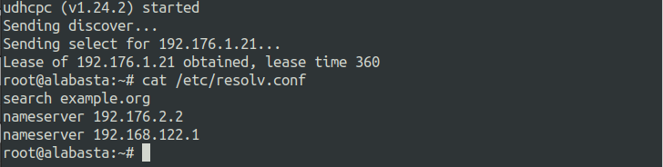
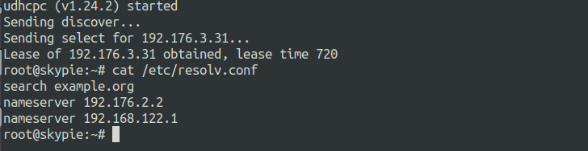
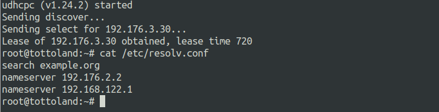

# Jarkom-Modul-3-A15-2021

Laporan Resmi Modul 3 Jaringan Komputer

### Anggota Kelompok :

|      NRP       |     Nama     |
| :------------: | :----------: |
| 05111940000034 | Aimar Wibowo |
| 05111940000064 | Ifanu Antoni |

## Nomor 1

Luffy bersama Zoro berencana membuat peta tersebut dengan kriteria `EniesLobby` sebagai DNS Server, `Jipangu` sebagai DHCP Server, `Water7` sebagai Proxy Server.

### Penjelasan Nomor 1

Pertama membuat topolgi seperti berikut


Kemudian melakukan config IP pada `Edit network configuration` pada setiap `node`.

`Foosha` sebagai Router / DHCP Relay

```
auto eth0
iface eth0 inet dhcp

auto eth1
iface eth1 inet static
	address 192.176.1.1
	netmask 255.255.255.0

auto eth2
iface eth2 inet static
	address 192.176.2.1
	netmask 255.255.255.0

auto eth3
iface eth3 inet static
	address 192.176.3.1
	netmask 255.255.255.0
```

`Loguetown` sebagai Client

```
auto eth0
iface eth0 inet static
	address 192.176.1.2
	netmask 255.255.255.0
	gateway 192.176.1.1
```

`Alabasta` sebagai Client

```
auto eth0
iface eth0 inet static
	address 192.176.1.3
	netmask 255.255.255.0
	gateway 192.176.1.1
```

`EniesLobby` sebagai DNS Master

```
auto eth0
iface eth0 inet static
	address 192.176.2.2
	netmask 255.255.255.0
	gateway 192.176.2.1
```

`Water7` sebagai Proxy Server

```
auto eth0
iface eth0 inet static
	address 192.176.2.3
	netmask 255.255.255.0
	gateway 192.176.2.1
```

`Jipanggu` sebagai DHCP Server

```
auto eth0
iface eth0 inet static
	address 192.176.2.4
	netmask 255.255.255.0
	gateway 192.176.2.1
```

`Skypie` sebagai Client

```
auto eth0
iface eth0 inet static
	address 192.176.3.2
	netmask 255.255.255.0
	gateway 192.176.3.1
```

`TottoLand` sebagai Client

```
auto eth0
iface eth0 inet static
	address 192.176.3.3
	netmask 255.255.255.0
	gateway 192.176.3.1
```

Melakukan `iptables -t nat -A POSTROUTING -o eth0 -j MASQUERADE -s 192.176.0.0/16` pada router `Foosha`.

Melakukan `echo nameserver 192.168.122.1 > /etc/resolv.conf` pada node ubuntu yang lain.

Sekarang semua `node` sudah terhubung dan bisa mengakses internet.


## Nomor 2
`Foosha` sebagai DHCP Relay.

### Penjelasan Nomor 2

Install aplikasi `isc-dhcp-server` pada `Foosha`.

```
apt-get install isc-dhcp-server -y
```

Edit file `/etc/default/isc-dhcp-relay` seperti pada gambar berikut:


Restart isc-dhcp-relay.

```
service isc-dhcp-relay restart
```

## Nomor 3

Client yang melalui `Switch1` mendapatkan range IP dari `[prefix IP].1.20` - `[prefix IP].1.99` dan `[prefix IP].1.150` - `[prefix IP].1.169`.

### Penjelasan Nomor 3

Install aplikasi `isc-dhcp-server` pada `Jipangu`.

```
apt-get install isc-dhcp-server -y
```

Edit file `/etc/default/isc-dhcp-server` seperti pada gambar berikut:


Edit file `/etc/dhcp/dhcpd.conf` seperti pada gambar berikut:



Restart `isc-dhcp-server`.

```
service isc-dhcp-server restart
```

Edit file `/etc/network/interfaces` pada `Loguetown` seperti pada gambar berikut:



Restart `Loguetown` dengan klik stop dan start pada node `Loguetown`.

Lakukan testing pada IP dan nameserver.



Edit file `/etc/network/interfaces` pada `Alabasta` seperti pada gambar berikut:


Restart `Alabasta` dengan klik stop dan start pada node `Alabasta`.

Lakukan testing pada IP dan nameserver.


## Nomor 4

Client yang melalui `Switch3` mendapatkan range IP dari `[prefix IP].3.30` - `[prefix IP].3.50`.

### Penjelasan nomor 4

Edit `file /etc/dhcp/dhcpd.conf` pada `Jipangu` seperti pada gambar berikut:


Restart `isc-dhcp-server`.

```
service isc-dhcp-server restart
```

Edit file `/etc/network/interfaces` pada `TottoLand` seperti pada gambar berikut:


Restart `TottoLand` dengan klik stop dan start pada node `TottoLand`.

Lakukan testing pada IP dan nameserver.


## Nomor 5

Client mendapatkan DNS dari `EniesLobby` dan client dapat terhubung dengan internet melalui DNS tersebut.

### Penjelasan nomor 5

Install aplikasi `bind9` pada `EniesLobby`.

```
apt-get install bind9 -y
```

Edit file /etc/bind/named.conf.options seperti pada gambar berikut:


Restart `bind9`.

```
service bind9 restart
```

Lakukan `ping google.com` pada `Loguetown`.


Lakukan `ping google.com` pada `Alabasta`.


Lakukan `ping google.com` pada `Skypie`.


Lakukan `ping google.com` pada `TottoLand`.


## Nomor 6

Lama waktu DHCP server meminjamkan alamat IP kepada Client yang melalui `Switch1` selama 6 menit sedangkan pada client yang melalui `Switch3` selama 12 menit. Dengan waktu maksimal yang dialokasikan untuk peminjaman alamat IP selama 120 menit.

### Penjelasan nomor 6

Pada `Jipangu`, edit file `/etc/dhcp/dhcpd.conf` di bagian `default-lease-time` dan `max-lease-time` seperti pada gambar berikut:


Restart `isc-dhcp-server`.

```
service isc-dhcp-server restart
```

## Nomor 7

Luffy dan Zoro berencana menjadikan `Skypie` sebagai server untuk jual beli kapal yang dimilikinya dengan alamat IP yang tetap dengan IP `[prefix IP].3.69`

### Penjelasan nomor 7

Mengatur hardware address static untuk `skypie` dengan menambahkan config pada `/etc/network/interfaces`

```
hwaddress ether 26:e0:8d:1f:9e:69
```

Menambahkan config pada DHCP server `jipangu` di file `/etc/dhcp/dhcpd.conf` dengan hardware address yang dimiliki `skypie` dengan fixed ip `192.176.3.69`

```
host skypie {
    hardware ethernet 26:e0:8d:1f:9e:69;
    fixed-address 192.176.3.69;
}
```

Restart isc-dhcp-server

```
service isc-dhcp-server restart
```

Testing

- Restart node `skypie` kemudian cek ip dengan command `ip a`

  

## Nomor 8

`Loguetown` digunakan sebagai client Proxy agar transaksi jual beli dapat terjamin keamanannya, juga untuk mencegah kebocoran data transaksi.

Pada `Loguetown`, proxy harus bisa diakses dengan nama `jualbelikapal.yyy.com` dengan port yang digunakan adalah `5000`.

### Penjelasan nomor 8

Menjadikan node `enieslobby` sebagai DNS server untuk `jualbelikapal.a15.com` yang ip nya mengarah ke `water7`

Install aplikasi bind9

```
apt-get update
apt-get install bind9 -y
```

Menambahkan zone untuk domain `jualbelikapal.a15.com` pada file `/etc/bind/named.conf.local`

```
zone "jualbelikapal.a15.com" {
        type master;
        file "/etc/bind/jarkom/jualbelikapal.a15.com";
};
```

Membuat folder jarkom di dalam `\etc\bind`

```
mkdir /etc/bind/jarkom
```

Menambahkan DNS record `jualbelikapal.a15.com` pada folder `/etc/bind/jarkom` dengan nama `jualbelikapal.a15.com`, konfigurasi sebagai berikut

```
;
; BIND data file for local loopback interface
;
$TTL    604800
@       IN      SOA     jualbelikapal.a15.com. root.jualbelikapal.a15.com. (
                              2         ; Serial
                         604800         ; Refresh
                          86400         ; Retry
                        2419200         ; Expire
                         604800 )       ; Negative Cache TTL
;
@       IN      NS      jualbelikapal.a15.com.
@       IN      A       192.176.2.3; IP water7
```

Restart bind9

```
service bind9 restart
```

Menjadikan `water7` sebagai proxy server

Install squid

```
apt-get update
apt-get install squid -y
```

Backup configurasi default

```
mv /etc/squid/squid.conf /etc/squid/squid.conf.bak
```

Menambahkan configurasi proxy `jualbelikapal.a15.com` port `5000` yang disimpan pada `/etc/squid/squid.conf`

```
http_port 5000
visible_hostname Water7

dns_nameservers 192.176.2.2 192.168.122.1
```

Restart squid.

```
service squid restart
```

Testing

- pada `loguetown` install lynx dan aktifkan proxy untuk `jualbelikapal.a15.com`

  ```
  apt update
  apt install lynx -y

  export http_proxy="http://jualbelikapal.a15.com:5000"
  ```

- Buka `google.com` dengan lynx
  

  _Secara default proxy akan menolak semua access dengan protokol HTTP termasuk `google.com`_

## Nomor 9

Agar transaksi jual beli lebih aman dan pengguna website ada dua orang, proxy dipasang autentikasi user proxy dengan enkripsi MD5 dengan dua username, yaitu dengan password luffy_yyy dan zorobelikapalyyy dengan password zoro_yyy.

### Penjelasan nomor 9

Menambahkan configurasi proxy `jualbelikapal.a15.com` yang disimpan pada `/etc/squid/squid.conf`

```
auth_param basic program /usr/lib/squid/basic_ncsa_auth /etc/squid/passwd
auth_param basic children 5
auth_param basic realm Proxy
auth_param basic credentialsttl 2 hours
auth_param basic casesensitive on
acl USERS proxy_auth REQUIRED
http_access allow USERS
```

Membuat user login untuk luffy dan zoro

Install apache2-utils

```
apt update
apt install apache2-utils -y
```

Menambahkan user dan password

```
htpasswd -c -b -m /etc/squid/passwd zorobelikapala15 zoro_a15
htpasswd -b -m /etc/squid/passwd luffybelikapala15 luffy_a15
```

Restart squid.

```
service squid restart
```

Testing

- Dari `loguetown` buka `google.com` menggunakan lynx.

  
  
  

## Nomor 10

Transaksi jual beli tidak dilakukan setiap hari, oleh karena itu akses internet dibatasi hanya dapat diakses setiap hari `Senin-Kamis pukul 07.00-11.00` dan setiap hari `Selasa-Jum’at pukul 17.00-03.00` keesokan harinya (sampai `Sabtu pukul 03.00`).

### Penjelasan nomor 10

Menambahkan configurasi proxy `jualbelikapal.a15.com` yang disimpan pada `/etc/squid/squid.conf`

```
include /etc/squid/acl.conf

http_access allow USERS AVAILABLE_WORKING_1
http_access allow USERS AVAILABLE_WORKING_2
http_access allow USERS AVAILABLE_WORKING_3
http_access deny all
```

Membuat file baru `acl.conf` pada folder `/etc/squid/`

```
acl AVAILABLE_WORKING_1 time MTWH 07:00-11:00
acl AVAILABLE_WORKING_2 time TWHF 17:00-24:00
acl AVAILABLE_WORKING_3 time WHFA 00:00-03:00
```

Restart squid.

```
service squid restart
```

Testing

- Pada `loguetown` cek hari dan jam nya dengan command `date`.

  

- Buka `google.com` dengan lynx, karena hari dan jamnya menunjukan bukan jam kerja maka access akan ditolak

  

## Nomor 11

Agar transaksi bisa lebih fokus berjalan, maka dilakukan redirect website agar mudah mengingat website transaksi jual beli kapal. Setiap mengakses `google.com`, akan diredirect menuju `super.franky.yyy.com` dengan website yang sama pada soal shift modul 2. Web server `super.franky.yyy.com` berada pada node `Skypie` .

### Penjelasan nomor 11

Menjadikan node `skypie` menjadi web server untuk `super.franky.a15.com`

Install apache2, php, library php, wget dan unzip

```
apt-get update
apt-get install apache2 -y
apt-get install php -y
apt-get install libapache2-mod-php7.0 -y
apt-get install wget -y
apt-get install unzip -y

```

Mendapatkan paket untuk `super.franky.a15.com`

```
wget https://raw.githubusercontent.com/FeinardSlim/Praktikum-Modul-2-Jarkom/main/super.franky.zip
```

Unzip paket yang sudah didownload dan disimpan pada folder `/var/www/` dengan nama `super.franky.a15.com`

```
unzip super.franky.zip -d /var/www
mv /var/www/super.franky /var/www/super.franky.a15.com

```

Menambahkan file configurasi virtual host port `5000` pada folder `/etc/apache2/sites-available` dengan nama `super.franky.a15.com.conf`

```
<VirtualHost \*:5000>

        ServerAdmin webmaster@localhost
        DocumentRoot /var/www/super.franky.a15.com
        ServerName super.franky.a15.com
        ServerAlias www.super.franky.a15.com

        ErrorLog ${APACHE_LOG_DIR}/error.log
        CustomLog ${APACHE_LOG_DIR}/access.log combined

</VirtualHost>
```

Menambahkan listen port `5000` pada `/etc/apache2/ports.conf`

Aktifkan `super.franky.a15.com`

```
cd /etc/apache2/sites-available/
a2ensite super.franky.a15.com.conf
cd
```

Restart apache2

```
service apache2 restart
```

Menambahkan zone pada `enieslobby` untuk domain `super.franky.a15.com` pada file `/etc/bind/named.conf.local`

```
zone "super.franky.a15.com" {
        type master;
        file "/etc/bind/jarkom/super.franky.a15.com";
};
```

Membuat folder jarkom di dalam `/etc/bind`

```
mkdir /etc/bind/jarkom
```

Menambahkan DNS record `super.franky.a15.com` pada folder `/etc/bind/jarkom` dengan nama `super.franky.a15.com`, konfigurasi sebagai berikut

```
;
; BIND data file for local loopback interface
;
$TTL    604800
@       IN      SOA     super.franky.a15.com. root.super.franky.a15.com. (
                              2         ; Serial
                         604800         ; Refresh
                          86400         ; Retry
                        2419200         ; Expire
                         604800 )       ; Negative Cache TTL
;
@       IN      NS      super.franky.a15.com.
@       IN      A       192.176.3.69;
www     IN      CNAME   super.franky.a15.com
```

Restart bind9

```
service bind9 restart
```

Pada water7 ditambahkan configurasi proxy pada `/etc/squid/squid.conf`

```
acl DRT dstdomain google.com
deny_info http://super.franky.a15.com:5000/ DRT
http_reply_access deny DRT
```

Restart squid

```
service squid restart
```

Testing

- Pada `loguetown` buka `google.com` menggunakan lynx maka akan diarahkan ke `super.franky.a15.com`.

  

## Nomor 12

Saatnya berlayar! Luffy dan Zoro akhirnya memutuskan untuk berlayar untuk mencari harta karun di `super.franky.yyy.com`. Tugas pencarian dibagi menjadi dua misi, Luffy bertugas untuk mendapatkan gambar `(.png, .jpg)`, sedangkan Zoro mendapatkan sisanya. Karena Luffy orangnya sangat teliti untuk mencari harta karun, ketika ia berhasil mendapatkan gambar, ia mendapatkan gambar dan melihatnya dengan kecepatan `10 kbps`.

### Penjelasan nomor 12

Pada water7 ditambahkan configurasi proxy pada `/etc/squid/squid.conf`

```
include /etc/squid/acl-bandwidth.conf
```

Membuat file baru `acl-bandwidth.conf` pada folder `/etc/squid/` dengan configurasi

```
acl download url_regex \.jpg$ \.png$
auth_param basic program /usr/lib/squid/basic_ncsa_auth /etc/squid/passwd
acl zoro proxy_auth zorobelikapala15
acl luffy proxy_auth luffybelikapala15

delay_pools 2
delay_class 1 1
delay_parameters 1 1256/1256
delay_access 1 deny zoro
delay_access 1 allow download
delay_access 1 deny all
```

Restart squid

```
service squid restart
```

Testing

- Pada `loguetown` buka `google.com` menggunakan lynx, Masuk dengan user `luffy`
  

- Masuk ke folder `public/image`
  
- Download file yang berekstensi `.png/.jpg`
  
  

  _Terlihat ketika user luffy mendownload file .jpg kecepatan di limit 1,4 KiB/s_

## Nomor 13

Sedangkan, Zoro yang sangat bersemangat untuk mencari harta karun, sehingga kecepatan kapal Zoro tidak dibatasi ketika sudah mendapatkan harta yang diinginkannya.

### Penjelasan nomor 13

Menambahkan configurasi pada `/etc/squid/acl-bandwidth.conf`

```
delay_class 2 1
delay_parameters 2 -1/-1
delay_access 2 deny luffy
delay_access 2 allow zoro
delay_access 2 deny all
```

Restart squid

```
service squid restart
```

Testing

- Pada `loguetown` buka `google.com` menggunakan lynx, Masuk dengan user `zoro`


- Masuk ke folder `public/image`


- Download sembarang file


  
  _Terlihat ketika user zoro mendownload file kecepatan unlimited_

<br>

## Kendala

1. Nomor 10 , saat demo tidak bisa dijalankan karena configurasi terdapat typo berupa "space" pada saat scripting
