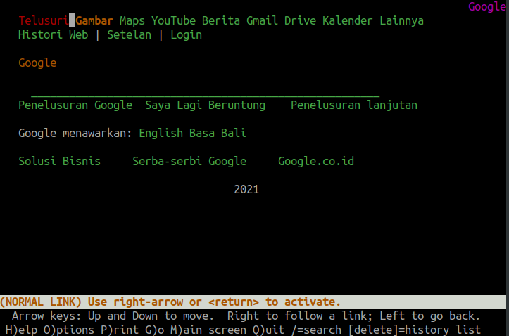
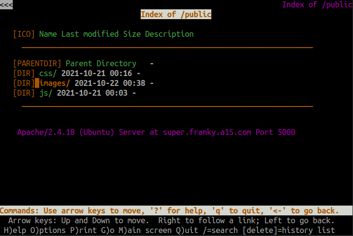
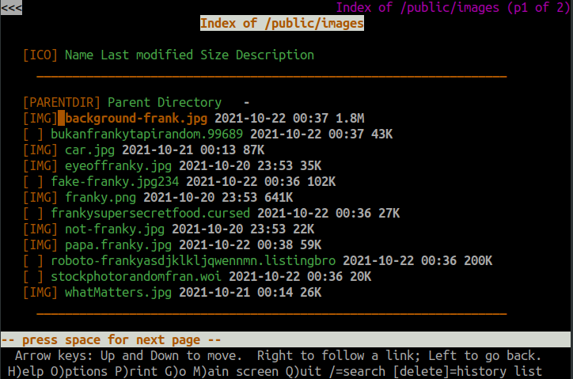
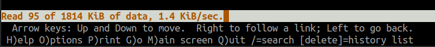
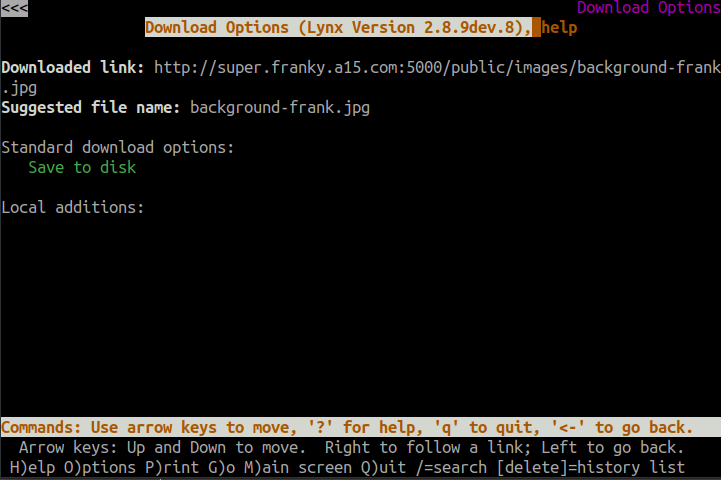

# Jarkom-Modul-3-A15-2021

Laporan Resmi 3 Modul 3 Jaringan Komputer

### Anggota Kelompok :

|      NRP       |     Nama     |
| :------------: | :----------: |
| 05111940000034 | Aimar Wibowo |
| 05111940000064 | Ifanu Antoni |

## Nomor 1

`EniesLobby` akan dijadikan sebagai DNS Master, `Water7` akan dijadikan DNS Slave, dan `Skypie` akan digunakan sebagai Web Server. Terdapat 2 Client yaitu `Loguetown`, dan `Alabasta`. Semua node terhubung pada router `Foosha`, sehingga dapat mengakses internet.

### Penjelasan Nomor 1

Pertama membuat topolgi seperti berikut


Kemudian melakukan config IP pada `Edit network configuration` pada setiap `node`.

`Foosha` sebagai router

```
auto eth0
iface eth0 inet dhcp

auto eth1
iface eth1 inet static
	address 192.176.1.1
	netmask 255.255.255.0

auto eth2
iface eth2 inet static
	address 192.176.2.1
	netmask 255.255.255.0
```

`EniesLobby` sebagai DNS master

```
auto eth0
iface eth0 inet static
	address 192.176.2.2
	netmask 255.255.255.0
	gateway 192.176.2.1
    up echo nameserver 192.168.122.1 > /etc/resolv.conf
```

`Water7` sebagai DNS slave

```
auto eth0
iface eth0 inet static
	address 192.176.2.3
	netmask 255.255.255.0
	gateway 192.176.2.1
    up echo nameserver 192.168.122.1 > /etc/resolv.conf
```

`Skypie` sebagai Web Server

```
auto eth0
iface eth0 inet static
	address 192.176.2.4
	netmask 255.255.255.0
	gateway 192.176.2.1
    up echo nameserver 192.168.122.1 > /etc/resolv.conf
```

`Loguetown` sebagai client

```
auto eth0
iface eth0 inet static
	address 192.176.1.2
	netmask 255.255.255.0
	gateway 192.176.1.1
    up echo nameserver 192.168.122.1 > /etc/resolv.conf
```

`Alabasta` sebagai client

```
auto eth0
iface eth0 inet static
	address 192.176.1.3
	netmask 255.255.255.0
	gateway 192.176.1.1
    up echo nameserver 192.168.122.1 > /etc/resolv.conf
```

Melakukan `iptables -t nat -A POSTROUTING -o eth0 -j MASQUERADE -s 192.176.0.0/16` pada router `Foosha`.

Sekarang semua `node` sudah terhubung dan bisa mengakses internet.


## Nomor 2

Luffy ingin menghubungi Franky yang berada di `EniesLobby` dengan denden mushi. Kalian diminta Luffy untuk membuat website utama dengan mengakses `franky.yyy.com` dengan alias `www.franky.yyy.com` pada folder `kaizoku`.

### Penjelasan Nomor 2

Install aplikasi bind9 pada `enieslobby`.

```
apt-get install bind9 -y
```

Menambahkan zone untuk domain `franky.a15.com` pada file `/etc/bind/named.conf.local`

```
zone "franky.a15.com" {
        type master;
        file "/etc/bind/kaizoku/franky.a15.com";
}
```

Membuat folder kaizoku di dalam `\etc\bind`

```
mkdir /etc/bind/kaizoku
```

Menambahkan DNS record `franky.a15.com` pada folder `/etc/bind/kaizoku` dengan nama `franky.a15.com`, konfigurasi sebagai berikut

```
;
; BIND data file for local loopback interface
;
$TTL    604800
@       IN      SOA     franky.a15.com. root.franky.a15.com. (
                              2         ; Serial
                         604800         ; Refresh
                          86400         ; Retry
                        2419200         ; Expire
                         604800 )       ; Negative Cache TTL
;
@       IN      NS      franky.a15.com.
@       IN      A       192.176.2.2;
www     IN      CNAME   franky.a15.com. ;add cname www.franky.a15.com
```

Restart bind9

```
service bind9 restart
```

Testing

- pada `logueton` edit nameserver pada file `/etc/resolv.conf` diarahkan ke IP `enieslobby`
  ```
  nameserver 192.176.2.2
  ```
- Ping ke `franky.a15.com` dan `www.franky.a15.com`

  

## Nomor 3

Setelah itu buat subdomain `super.franky.yyy.com` dengan alias `www.super.franky.yyy.com` yang diatur DNS nya di `enieslobby` dan mengarah ke `skypie`.

### Penjelasan Nomor 3

Menambahkan config pada DNS record `franky.a15.com` dengan IP mengarah ke `skypie`

```
; BIND data file for local loopback interface
;
$TTL    604800
@       IN      SOA     franky.a15.com. root.franky.a15.com. (
                              2         ; Serial
                         604800         ; Refresh
                          86400         ; Retry
                        2419200         ; Expire
                         604800 )       ; Negative Cache TTL
;
@       IN      NS      franky.a15.com.
@       IN      A       192.176.2.2 ;
www     IN      CNAME   franky.a15.com. ;add cname www.franky.a15.com

super        IN      A       192.176.2.4 ;add subdomain super to skypie
www.super	 IN     CNAME   super ;add cname www.super.franky.a15.com
```

Restart bind9

```
service bind9 restart
```

Testing

- Ping dari `loguetown` ke `super.franky.a15.com` dan `www.super.franky.a15.com`

  

## Nomor 4

Buat juga reverse domain untuk domain utama.

### Penjelasan nomor 4

Menambahkan zone untuk reverse domain `franky.a15.com` pada file `/etc/bind/named.conf.local`

```
zone "2.176.192.in-addr.arpa" {
    type master;
    file "/etc/bind/kaizoku/2.176.192.in-addr.arpa";
};
```

Menambahkan reverse DNS record `franky.a15.com` pada folder `/etc/bind/kaizoku` dengan nama `2.176.192.in-addr.arpa`, konfigurasi sebagai berikut

```
; BIND data file for local loopback interface
;
$TTL    604800
@       IN      SOA     franky.a15.com. root.franky.a15.com. (
                              2         ; Serial
                         604800         ; Refresh
                          86400         ; Retry
                        2419200         ; Expire
                         604800 )       ; Negative Cache TTL
;
2.176.192.in-addr.arpa.   IN      NS     franky.a15.com.
2                         IN      PTR     franky.a15.com. ; byte ke 4 enieslobby
```

Restart bind9

```
service bind9 restart
```

Testing

- Install dnsutils pada `loguetown`
  ```
  apt-get update
  apt-get install dnsutils -y
  ```
- Melakukan pengecekan dengan command `host -t PTR 192.176.2.2`

  

## Nomor 5

Supaya tetap bisa menghubungi Franky jika server `enieslobby` rusak, maka buat `water7` sebagai DNS Slave untuk domain utama.

### Penjelasan nomor 5

Menambahkan config zone dns slave pada `/etc/bind/named.conf.local` di `enieslobby`

```
zone "franky.a15.com" {
        type master;
        notify yes;
        also-notify {192.176.2.3;};
        allow-transfer {192.176.2.3;};
        file "/etc/bind/kaizoku/franky.a15.com";
};
```

Restart bind9

```
service bind9 restart
```

Install bind9 pada `water7`

```
apt-get update
apt-get install bind9 -y
```

Menambahkan zone untuk domain `franky.a15.com` pada file `/etc/bind/named.conf.local` dengan type slave dan mengarah ke `enieslobby`

```
zone "franky.a15.com" {
    type slave;
    masters {192.176.2.2; };
    file "/var/lib/bind/franky.a15.com";
};
```

Restart bind9.

```
service bind9 restart
```

Testing

- Matikan bind9 pada `enieslobby`
  ```
  service bind9 stop
  ```
- Menambahkan config nameserver pada `loguetown` mengarah ke IP `water7`
  ```
  nameserver 192.176.2.2
  nameserver 192.176.2.3
  ```
- Ping dari `loguetown` ke `franky.a15.com`

  

## Nomor 6

Setelah itu terdapat subdomain `mecha.franky.yyy.com` dengan alias `www.mecha.franky.yyy.com` yang didelegasikan dari `enieslobby` ke `water7` dengan IP menuju ke `skypie` dalam folder `sunnygo`.

### Penjelasan nomor 6

Menambahkan config pada DNS record `franky.a15.com`

```
;
; BIND data file for local loopback interface
;
$TTL    604800
@       IN      SOA     franky.a15.com. root.franky.a15.com. (
                              2         ; Serial
                         604800         ; Refresh
                          86400         ; Retry
                        2419200         ; Expire
                         604800 )       ; Negative Cache TTL
;
@       IN      NS      franky.a15.com.
@       IN      A       192.176.2.2 ;
www     IN      CNAME   franky.a15.com. ;add cname www.franky.a15.com

super       IN      A       192.176.2.4 ;add subdomain super to skypie
www.super	IN     CNAME   super ;add cname www.super.franky.a15.com

ns1     	IN      A       192.176.2.3 ;add subdomain ns1 to water7
mecha     	IN      NS      ns1 ;delegation subdomain ns1 to mecha
```

Edit configrasi file `/etc/bind/named.conf.options`

```
options {
        directory "/var/cache/bind";

        // If there is a firewall between you and nameservers you want
        // to talk to, you may need to fix the firewall to allow multiple
        // ports to talk.  See http://www.kb.cert.org/vuls/id/800113

        // If your ISP provided one or more IP addresses for stable
        // nameservers, you probably want to use them as forwarders.
        // Uncomment the following block, and insert the addresses replacing
        // the all-0s placeholder.
        //forwarders {
        //192.168.122.1;
        //};
        //========================================================================
        // If BIND logs error messages about the root key being expired,
        // you will need to update your keys.  See https://www.isc.org/bind-keys
        //========================================================================
        //dnssec-validation auto;
        allow-query{any;};

        auth-nxdomain no;    # conform to RFC1035
        listen-on-v6 { any; };
};
```

Restart bind9.

```
service bind9 restart
```

Pada `water7` edit config juga file `/etc/bind/named.conf.options` sama seperti pada `enieslobby`

Menambahkan zone pada file `/etc/bind/named.conf.local`

```
zone "mecha.franky.a15.com"{
  type master;
  file "/etc/bind/sunnygo/mecha.franky.a15.com";
};
```

Membuuat folder `sunnygo` di dalam `/etc/bind`.

```
mkdir /etc/bind/sunnygo
```

Menambahkan DNS record di `/etc/bind/sunnygo` untuk subdomain `mecha.franky.a15.com`

```
;
; BIND data file for local loopback interface
;
$TTL	604800
@	IN	SOA	mecha.franky.a15.com. root.mecha.franky.a15.com. (
			      2		; Serial
			 604800		; Refresh
			  86400		; Retry
			2419200		; Expire
			 604800 )	; Negative Cache TTL
;
@		IN	NS	mecha.franky.a15.com.
@		IN	A	192.176.2.4 ;IP skypie
www		IN	CNAME	mecha.franky.a15.com;

```

Restart bind9

```
service bind9 restart
```

Testing

- Ping dari `loguetown` ke `mecha.franky.a15.com` dan `www.mecha.franky.a15.com`

  

## Nomor 7

Luffy dan Zoro berencana menjadikan `Skypie` sebagai server untuk jual beli kapal yang dimilikinya dengan alamat IP yang tetap dengan IP `[prefix IP].3.69`

### Penjelasan nomor 7

Mengatur hardware address static untuk `skypie` dengan menambahkan config pada `/etc/network/interfaces`

```
hwaddress ether 26:e0:8d:1f:9e:69
```

Menambahkan config pada DHCP server `jipangu` di file `/etc/dhcp/dhcpd.conf` dengan hardware address yang dimiliki `skypie` dengan fixed ip `192.176.3.69`

```
host skypie {
    hardware ethernet 26:e0:8d:1f:9e:69;
    fixed-address 192.176.3.69;
}
```

Restart isc-dhcp-server

```
service isc-dhcp-server restart
```

Testing

- Restart node `skypie` kemudian cek ip dengan command `ip a`

  

## Nomor 8

`Loguetown` digunakan sebagai client Proxy agar transaksi jual beli dapat terjamin keamanannya, juga untuk mencegah kebocoran data transaksi.

Pada `Loguetown`, proxy harus bisa diakses dengan nama `jualbelikapal.yyy.com` dengan port yang digunakan adalah `5000`.

### Penjelasan nomor 8

Menjadikan node `enieslobby` sebagai DNS server untuk `jualbelikapal.a15.com` yang ip nya mengarah ke `water7`

Install aplikasi bind9

```
apt-get update
apt-get install bind9 -y
```

Menambahkan zone untuk domain `jualbelikapal.a15.com` pada file `/etc/bind/named.conf.local`

```
zone "jualbelikapal.a15.com" {
        type master;
        file "/etc/bind/jarkom/jualbelikapal.a15.com";
};
```

Membuat folder jarkom di dalam `\etc\bind`

```
mkdir /etc/bind/jarkom
```

Menambahkan DNS record `jualbelikapal.a15.com` pada folder `/etc/bind/jarkom` dengan nama `jualbelikapal.a15.com`, konfigurasi sebagai berikut

```
;
; BIND data file for local loopback interface
;
$TTL    604800
@       IN      SOA     jualbelikapal.a15.com. root.jualbelikapal.a15.com. (
                              2         ; Serial
                         604800         ; Refresh
                          86400         ; Retry
                        2419200         ; Expire
                         604800 )       ; Negative Cache TTL
;
@       IN      NS      jualbelikapal.a15.com.
@       IN      A       192.176.2.3; IP water7
```

Restart bind9

```
service bind9 restart
```

Menjadikan `water7` sebagai proxy server

Install squid

```
apt-get update
apt-get install squid -y
```

Backup configurasi default

```
mv /etc/squid/squid.conf /etc/squid/squid.conf.bak
```

Menambahkan configurasi proxy `jualbelikapal.a15.com` port `5000` yang disimpan pada `/etc/squid/squid.conf`

```
http_port 5000
visible_hostname Water7

dns_nameservers 192.176.2.2 192.168.122.1
```

Restart squid.

```
service squid restart
```

Testing

- pada `loguetown` install lynx dan aktifkan proxy untuk `jualbelikapal.a15.com`

  ```
  apt update
  apt install lynx -y

  export http_proxy="http://jualbelikapal.a15.com:5000"
  ```

- Buka `google.com` dengan lynx
  

  _Secara default proxy akan menolak semua access dengan protokol HTTP termasuk `google.com`_

## Nomor 9

Agar transaksi jual beli lebih aman dan pengguna website ada dua orang, proxy dipasang autentikasi user proxy dengan enkripsi MD5 dengan dua username, yaitu dengan password luffy_yyy dan zorobelikapalyyy dengan password zoro_yyy.

### Penjelasan nomor 9

Menambahkan configurasi proxy `jualbelikapal.a15.com` yang disimpan pada `/etc/squid/squid.conf`

```
auth_param basic program /usr/lib/squid/basic_ncsa_auth /etc/squid/passwd
auth_param basic children 5
auth_param basic realm Proxy
auth_param basic credentialsttl 2 hours
auth_param basic casesensitive on
acl USERS proxy_auth REQUIRED
http_access allow USERS
```

Membuat user login untuk luffy dan zoro

Install apache2-utils

```
apt update
apt install apache2-utils -y
```

Menambahkan user dan password

```
htpasswd -c -b -m /etc/squid/passwd zorobelikapala15 zoro_a15
htpasswd -b -m /etc/squid/passwd luffybelikapala15 luffy_a15
```

Restart squid.

```
service squid restart
```

Testing

- Dari `loguetown` buka `google.com` menggunakan lynx.

  
  
  

## Nomor 10

Transaksi jual beli tidak dilakukan setiap hari, oleh karena itu akses internet dibatasi hanya dapat diakses setiap hari `Senin-Kamis pukul 07.00-11.00` dan setiap hari `Selasa-Jum’at pukul 17.00-03.00` keesokan harinya (sampai `Sabtu pukul 03.00`).

### Penjelasan nomor 10

Menambahkan configurasi proxy `jualbelikapal.a15.com` yang disimpan pada `/etc/squid/squid.conf`

```
include /etc/squid/acl.conf

http_access allow USERS AVAILABLE_WORKING_1
http_access allow USERS AVAILABLE_WORKING_2
http_access allow USERS AVAILABLE_WORKING_3
http_access deny all
```

Membuat file baru `acl.conf` pada folder `/etc/squid/`

```
acl AVAILABLE_WORKING_1 time MTWH 07:00-11:00
acl AVAILABLE_WORKING_2 time TWHF 17:00-24:00
acl AVAILABLE_WORKING_3 time WHFA 00:00-03:00
```

Restart squid.

```
service squid restart
```

Testing

- Pada `loguetown` cek hari dan jam nya dengan command `date`.

  

- Buka `google.com` dengan lynx, karena hari dan jamnya menunjukan bukan jam kerja maka access akan ditolak

  

## Nomor 11

Agar transaksi bisa lebih fokus berjalan, maka dilakukan redirect website agar mudah mengingat website transaksi jual beli kapal. Setiap mengakses `google.com`, akan diredirect menuju `super.franky.yyy.com` dengan website yang sama pada soal shift modul 2. Web server `super.franky.yyy.com` berada pada node `Skypie` .

### Penjelasan nomor 11

Menjadikan node `skypie` menjadi web server untuk `super.franky.a15.com`

Install apache2, php, library php, wget dan unzip

```
apt-get update
apt-get install apache2 -y
apt-get install php -y
apt-get install libapache2-mod-php7.0 -y
apt-get install wget -y
apt-get install unzip -y

```

Mendapatkan paket untuk `super.franky.a15.com`

```
wget https://raw.githubusercontent.com/FeinardSlim/Praktikum-Modul-2-Jarkom/main/super.franky.zip
```

Unzip paket yang sudah didownload dan disimpan pada folder `/var/www/` dengan nama `super.franky.a15.com`

```
unzip super.franky.zip -d /var/www
mv /var/www/super.franky /var/www/super.franky.a15.com

```

Menambahkan file configurasi virtual host port `5000` pada folder `/etc/apache2/sites-available` dengan nama `super.franky.a15.com.conf`

```
<VirtualHost \*:5000>

        ServerAdmin webmaster@localhost
        DocumentRoot /var/www/super.franky.a15.com
        ServerName super.franky.a15.com
        ServerAlias www.super.franky.a15.com

        ErrorLog ${APACHE_LOG_DIR}/error.log
        CustomLog ${APACHE_LOG_DIR}/access.log combined

</VirtualHost>
```

Menambahkan listen port `5000` pada `/etc/apache2/ports.conf`

Aktifkan `super.franky.a15.com`

```
cd /etc/apache2/sites-available/
a2ensite super.franky.a15.com.conf
cd
```

Restart apache2

```
service apache2 restart
```

Menambahkan zone pada `enieslobby` untuk domain `super.franky.a15.com` pada file `/etc/bind/named.conf.local`

```
zone "super.franky.a15.com" {
        type master;
        file "/etc/bind/jarkom/super.franky.a15.com";
};
```

Membuat folder jarkom di dalam `/etc/bind`

```
mkdir /etc/bind/jarkom
```

Menambahkan DNS record `super.franky.a15.com` pada folder `/etc/bind/jarkom` dengan nama `super.franky.a15.com`, konfigurasi sebagai berikut

```
;
; BIND data file for local loopback interface
;
$TTL    604800
@       IN      SOA     super.franky.a15.com. root.super.franky.a15.com. (
                              2         ; Serial
                         604800         ; Refresh
                          86400         ; Retry
                        2419200         ; Expire
                         604800 )       ; Negative Cache TTL
;
@       IN      NS      super.franky.a15.com.
@       IN      A       192.176.3.69;
www     IN      CNAME   super.franky.a15.com
```

Restart bind9

```
service bind9 restart
```

Pada water7 ditambahkan configurasi proxy pada `/etc/squid/squid.conf`

```
acl DRT dstdomain google.com
deny_info http://super.franky.a15.com:5000/ DRT
http_reply_access deny DRT
```

Restart squid

```
service squid restart
```

Testing

- Pada `loguetown` buka `google.com` menggunakan lynx maka akan diarahkan ke `super.franky.a15.com`.

  

## Nomor 12

Saatnya berlayar! Luffy dan Zoro akhirnya memutuskan untuk berlayar untuk mencari harta karun di `super.franky.yyy.com`. Tugas pencarian dibagi menjadi dua misi, Luffy bertugas untuk mendapatkan gambar `(.png, .jpg)`, sedangkan Zoro mendapatkan sisanya. Karena Luffy orangnya sangat teliti untuk mencari harta karun, ketika ia berhasil mendapatkan gambar, ia mendapatkan gambar dan melihatnya dengan kecepatan `10 kbps`.

### Penjelasan nomor 12

Pada water7 ditambahkan configurasi proxy pada `/etc/squid/squid.conf`

```
include /etc/squid/acl-bandwidth.conf
```

Membuat file baru `acl-bandwidth.conf` pada folder `/etc/squid/` dengan configurasi

```
acl download url_regex \.jpg$ \.png$
auth_param basic program /usr/lib/squid/basic_ncsa_auth /etc/squid/passwd
acl zoro proxy_auth zorobelikapala15
acl luffy proxy_auth luffybelikapala15

delay_pools 2
delay_class 1 1
delay_parameters 1 1256/1256
delay_access 1 deny zoro
delay_access 1 allow download
delay_access 1 deny all
```

Restart squid

```
service squid restart
```

Testing

- Pada `loguetown` buka `google.com` menggunakan lynx, Masuk dengan user `luffy`
  

- Masuk ke folder `public/image`
  
- Download file yang berekstensi `.png/.jpg`
  
  

  _Terlihat ketika user luffy mendownload file .jpg kecepatan di limit 1,4 KiB/s_

## Nomor 13

Sedangkan, Zoro yang sangat bersemangat untuk mencari harta karun, sehingga kecepatan kapal Zoro tidak dibatasi ketika sudah mendapatkan harta yang diinginkannya.

### Penjelasan nomor 13

Menambahkan configurasi pada `/etc/squid/acl-bandwidth.conf`

```
delay_class 2 1
delay_parameters 2 -1/-1
delay_access 2 deny luffy
delay_access 2 allow zoro
delay_access 2 deny all
```

Restart squid

```
service squid restart
```

Testing

- Pada `loguetown` buka `google.com` menggunakan lynx, Masuk dengan user `zoro`


- Masuk ke folder `public/image`


- Download sembarang file


  
  _Terlihat ketika user zoro mendownload file kecepatan unlimited_

<br>

## Kendala

1. Nomor 10 , saat demo tidak bisa dijalankan karena configurasi terdapat typo berupa "space" pada saat scripting
